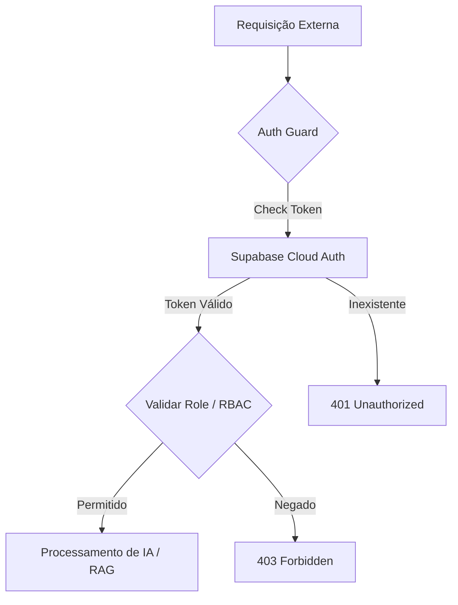

# 🤖 Chatbot Scouts - Security & Integration Core

Este repositório destaca a minha contribuição técnica no desenvolvimento de um chatbot inteligente para a União dos Escoteiros do Brasil. Meu foco foi a arquitetura de Backend, garantindo a integridade dos dados e a automação segura através de um sistema robusto de autenticação e integração via n8n

---

## 🛠️ Tecnologias Utilizadas
- **Auth Provider**: Supabase Auth (BaaS)
- **Identity**: JSON Web Tokens (JWT)
- **Middleware & Automação**: n8n logic pipelines
- **Authorization**: RBAC (Role-Based Access Control)
- **Infraestrutura**: Docker & Environment Secret Management

---

## 🔒 Minhas Contribuições (Destaques Técnicos)

### 1. Camada de Auth Guard (JWT Verification)
- Desenvolvi o Auth Guard centralizado (fluxo auth.guard.final-CORRETO.json) que funciona como a primeira linha de defesa do sistema.
- Validação de Sessão: Implementei a lógica em JavaScript para extração e validação de tokens Bearer.
- Integração Cloud: O fluxo comunica-se diretamente com a API do Supabase Auth para verificar a autenticidade da sessão em tempo real.

### 2. Implementação de RBAC (Controle de Acesso)
- Em vez de um acesso genérico, estruturei um controle baseado em funções (Roles).
- Através de lógica condicional no n8n, o sistema valida se o usuário possui a role necessária (Escoteiro ou Gestor) antes de permitir qualquer interação com a base de conhecimento ou dados sensíveis.

### 3. Gestão de Ciclo de Vida de Tokens
Fui o responsável pela criação dos fluxos de segurança para:
- Login Seguro: Intermediação entre o cliente e o endpoint de autenticação do Supabase.
- Refresh Token: Lógica de renovação de credenciais para manter a segurança sem prejudicar a experiência do usuário.

---

### 🏗️ Lógica de Proteção de Dados
O diagrama abaixo detalha a arquitetura de segurança que projetei:

### 📂 Estrutura do Repositório
- /infra: Contém os fluxos de segurança exportados (JSON) prontos para importação no n8n.
- /src: Scripts de lógica de segurança, extração de tokens e documentação do fluxo de autorização.

